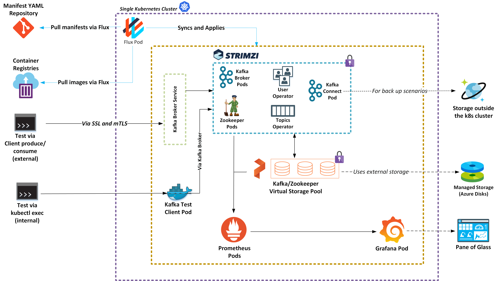

# fabrikate-kafka-sample

This Fabrikate defintion provides an end to end example of running a secure stateful workload with backed by virtual storage on AKS.



The following components are deployed on to your AKS cluster:
* Strimzi Kafka Operator (including Kafka Connect)
* Confluent Schema Registry
* Prometheus
* Grafana
* Portworx

## Installation Instructions
TODO

## Validations

The repository provides multiple tests to help prove the end to end goal. We have tests that execute from within the cluster and from outside the cluster. Additionally load tests targeted at the virtual storage layer and end to end layer.

## Caveats

Currently Portworx must be installed manually due to the lack of a Helm chart. Please refer to [instructions]() on how to successfuly install this sample.

## Future Work

- [ ] Work with Portworx on Helm Chart
- [ ] Enable mTLS on ingress for Kafka load balancer
- [ ] Enable volume encryption on Portworx volumes
- [ ] Get past possible VNET issues in Terraform template

It also sets up a default scalable Kafka Cluster configuration (see [manifests/kafka-cluster.yaml](./manifests/kafka-cluster.yaml)) with persistent volumes, three replicas and TLS mutual authentication.

It also includes Kubernetes network policies to restrict traffic to the Kafka cluster (see [manifests/kafka-networkpolicy.yaml](./manifests/kafka-networkpolicies.yaml)). Only TLS traffic is permitted to the Kafka cluster. Plaintext is only permitted for the Confluent Schema Registry app.


## Perf Tests

A perftest is also included with the repo. This perf test creates clients within the Kafka namespaces and uses TLS mutual authentication.

## Replication

A sample configuration for mirror maker is included with the repo. Upload the destination cluster's certificate into a secret called `mirrormaker-cluster-ca-cert` in the `kafka` namespace, and add the IP address of the destination cluster's broker into `mirror-maker.yaml`. You will also need to create a KafkaUser for the second cluster in order to authenticate Mirror Maker with your cluster. To test out Mirror Maker, run ./test/mirror-maker.sh to set up clients within the Kafka namespace authenticated with mutual TLS authentication. You can then test out replication by using the kafkaclient pods:

```
kubectl exec -it kafkaclient-0 --namespace kafka -- /bin/bash
./bin/kafka-console-producer.sh --broker-list kcluster-kafka-bootstrap:9093 --topic test-replication --producer.config config/client-ssl.properties

kubectl exec -it kafkaclient-1 --namespace kafka -- /bin/bash
./bin/kafka-console-consumer.sh --bootstrap-server <DEST-IP>:9094 --topic test-replication --consumer.config config/mm-client-ssl.properties --from-beginning
```

## Setting Up Grafana Dashboards

The sample configuration provided does not expose grafana and prometheus metrics through an externally accessible IP. You may choose to create an external IP. Alternatively, you can connect to your cluster and port forward the grafana dashboard.

`kubectl port-forward [POD NAME HERE grafana] -n grafana 3000`

Browse to `localhost:3000/dashboard/import`.

There are six dashboards [Kafka, Kafka Connect, Zookeeper Metrics, Portworx Node, Portworx Volume, and Portworx Cluster] included in the `dashboards/` folder. You can either copy paste the content of the json files or use the "Upload .json File".
